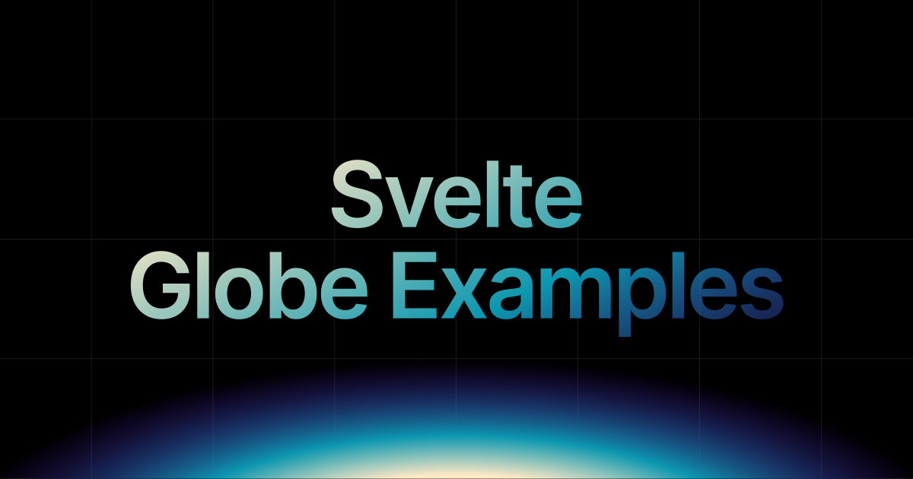

# Svelte Globe Examples

Setup guides and copyable example patterns for building interactive 3D globe interfaces in Svelte with COBE.

Live site: https://sv-globe.vercel.app

## Usage

Use the site in this order:

- [Installation & Setup](https://sv-globe.vercel.app/setup) for the minimal globe setup
- [Usage](https://sv-globe.vercel.app/usage) for reusable globe patterns
- [Performance](https://sv-globe.vercel.app/performance) for render-cost guidance
- [Examples](https://sv-globe.vercel.app/examples) for richer showcase demos

## Example Links

- [`Flight Globe`](https://sv-globe.vercel.app/examples/flight)
- [`Sticker Globe`](https://sv-globe.vercel.app/examples/sticker)
- [`Polaroid Globe`](https://sv-globe.vercel.app/examples/polaroids)

## Credits

This project is built on top of [COBE](https://cobe.vercel.app), the open-source WebGL globe library by [Shu Ding](https://x.com/shuding).

## Sponsor

Sponsor my work on GitHub: [github.com/sponsors/SikandarJODD](https://github.com/sponsors/SikandarJODD)

## Follow

Follow my work on Twitter: [x.com/Sikandar_Bhide](https://x.com/Sikandar_Bhide)

Built by Bhide Svelte: [bhide.dev](https://bhide.dev?utm_source=github&utm_medium=readme&utm_campaign=sv-globe)
